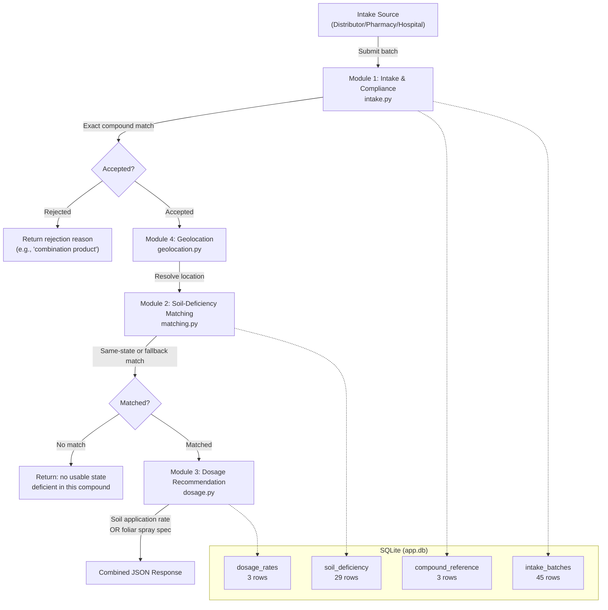

# PROJECT UNDERSTANDING — SIH-198

> Complete analysis of the workspace at `d:\SIH-2026\SIH-198`
> All files read. No files skipped. No files could not be opened.

---

## 1. Project Overview

This is a **Smart India Hackathon (SIH) 2026** project (Problem Statement ID: **198**). It is a **Traceable Recovery & Deployment Platform for Micronutrient Compounds from Expired Pharmaceuticals**.

The core idea: India has massive quantities of expired pharmaceutical stock (documented examples: ₹400+ crore destroyed in the 2016 FDC ban, Ranbaxy's Mohali write-offs, Abbott India disputes with chemists). Many of these expired medicines contain **single-compound mineral ingredients** (iron, zinc, potassium) that are chemically identical to standard agricultural fertilizers. Rather than destroying this stock, the platform proposes **recovering the active mineral compounds** and **redeploying them as soil micronutrient supplements** to regions with documented soil deficiency — under strict compliance, dosage, and safety controls.

---

## 2. Problem Statement

> There is currently **no system in India** that connects verified, composition-known expired pharmaceutical stock (held by distributors, pharmacies, and hospitals) with regions of documented soil micronutrient deficiency, to enable safe, dosage-controlled agricultural reuse of recoverable mineral compounds.

**Key gaps this addresses:**
- Expired stock is currently destroyed or landfilled — no recovery pathway exists
- Indian soils have severe micronutrient deficiencies (49% Zn-deficient, >33% Fe-deficient nationally per Naik et al., 2024)
- The same mineral compounds exist as both pharmaceutical products and standard agricultural fertilizers (e.g., Zinc Sulphate is both a medicine and a fertilizer)
- No coordination mechanism connects the supply side (expired pharma stock) with the demand side (deficient agricultural regions)

---

## 3. Proposed Solution

A **4-module pipeline** that runs end-to-end:

```
Expired Stock Intake → Compliance Filtering → Soil-Deficiency Matching → Dosage Recommendation
```

| Module | Function |
|---|---|
| **Module 1** — Intake & Compliance | Accept/reject batches based on whether the compound is one of the 3 approved single-compound medicines (exact match, no fuzzy/brand names) |
| **Module 2** — Soil-Deficiency Matching | Given an accepted batch's source location, find the nearest state with documented soil deficiency in that compound's mineral |
| **Module 3** — Dosage Recommendation | Given a matched region's soil test category (Low/Medium/High), return the ICAR GRD ±25% application rate — with a critical **foliar spray branch for Ferrous Sulphate** (not soil application) |
| **Module 4** — Geolocation | Resolve pincodes/city names to lat-long coordinates, compute distances for nearest-match logic |

**Deliberately out of scope:** actual chemical extraction (assumed handled by certified partner), logistics/transport, combination-formulation medicines, full ICAR STCR equations, compounds beyond the 3 approved ones.

**Tech stack (resolved):** Flask + SQLite + `indiapins` package + Streamlit (for UI). The core pipeline is intentionally **rule-based, not ML**. The only justified AI/ML component is a potential **OCR-based intake** (photographing batch labels → auto-extracted compound/expiry data) — noted as a stretch goal.

---

## 4. Complete Folder Structure

```
d:\SIH-2026\SIH-198\
├── PRD.md                                          # Product Requirements Document
├── AI_Build_Prompts.md                             # Step-by-step AI coding prompts (5 prompts)
├── Demo_Expired_Stock_Intake_Data_UPDATED.xlsx      # Synthetic demo data (Excel, 3 sheets)
├── State_Soil_Deficiency_Medicine_Match_FILTERED.xlsx # Soil deficiency reference (Excel, 2 sheets)
└── starter_kit/
    └── starter/
        ├── load_data.py                            # SQLite database initializer script
        ├── data/
        │   ├── compound_list.json                  # 3 approved compounds
        │   ├── dosage_table.json                   # ICAR dosage rates + foliar spec
        │   ├── soil_deficiency.json                # 29 states, deficiency data
        │   └── demo_intake.csv                     # 45 synthetic batch intake rows
        └── modules/                                # EMPTY — modules to be built here
```

---

## 5. Important Files

### Documentation

| File | Purpose |
|---|---|
| [PRD.md](file:///d:/SIH-2026/SIH-198/PRD.md) | Full Product Requirements Document — problem statement, 4 modules with acceptance criteria, data sources, success metrics, known limitations, open questions |
| [AI_Build_Prompts.md](file:///d:/SIH-2026/SIH-198/AI_Build_Prompts.md) | 5 sequential copy-paste prompts for an AI coding assistant to build all 4 modules + end-to-end Flask wiring. Includes verification checks after each prompt. |

### Data Files (JSON/CSV — in `starter_kit/starter/data/`)

| File | Purpose |
|---|---|
| [compound_list.json](file:///d:/SIH-2026/SIH-198/starter_kit/starter/data/compound_list.json) | The 3 approved single-compound medicines: Ferrous Sulphate (Fe), Zinc Sulphate (Zn), Potassium Chloride (K). Includes pharmaceutical product references and agricultural precedents. |
| [dosage_table.json](file:///d:/SIH-2026/SIH-198/starter_kit/starter/data/dosage_table.json) | ICAR GRD ±25% dosage rates. **Critical:** Ferrous Sulphate has `base_rate_kg_ha: null` and a `foliar_spec` field instead — must be handled as a branching case. |
| [soil_deficiency.json](file:///d:/SIH-2026/SIH-198/starter_kit/starter/data/soil_deficiency.json) | 29 Indian states/UTs with deficient nutrients, usable compounds, and usable/not_usable status. 17 states are "usable" (have at least one approved compound match). National baseline: 49% Zn-deficient, >33% Fe-deficient. |
| [demo_intake.csv](file:///d:/SIH-2026/SIH-198/starter_kit/starter/data/demo_intake.csv) | 45 synthetic batch intake rows with batch IDs, compound names, quantities, dates, source locations, source types, and intake statuses. All 45 use approved compound names (no combination products). |

### Source Code

| File | Purpose |
|---|---|
| [load_data.py](file:///d:/SIH-2026/SIH-198/starter_kit/starter/load_data.py) | Python script to initialize `app.db` (SQLite) with 4 tables: `compound_reference`, `soil_deficiency`, `dosage_rates`, `intake_batches`. Loads all JSON/CSV data. Sets `compliance_status` to NULL for all intake rows (to be filled by Module 1). |

### Excel Files (Reference/Documentation)

| File | Purpose |
|---|---|
| [Demo_Expired_Stock_Intake_Data_UPDATED.xlsx](file:///d:/SIH-2026/SIH-198/Demo_Expired_Stock_Intake_Data_UPDATED.xlsx) | 3 sheets: main data (same 45 rows as CSV), summary by compound (quantities/counts), and schema notes explaining generation method and presentation guidance |
| [State_Soil_Deficiency_Medicine_Match_FILTERED.xlsx](file:///d:/SIH-2026/SIH-198/State_Soil_Deficiency_Medicine_Match_FILTERED.xlsx) | 2 sheets: filtered state-compound match table (29 states, 17 usable), and detailed notes/caveats (soil ≠ human deficiency, combination products excluded, data source disclaimers) |

---

## 6. Technology Stack

| Layer | Technology | Status |
|---|---|---|
| **Backend** | Flask (Python) | Planned, not yet built |
| **Database** | SQLite (`app.db`) | Schema defined in `load_data.py`, not yet generated |
| **Geolocation** | `indiapins` Python package | Planned, not yet installed |
| **Frontend/UI** | Streamlit | Planned, not yet built |
| **AI/ML** | OCR for batch label reading | Stretch goal only, not yet planned in detail |
| **Core Logic** | Rule-based (exact compound match, GRD ±25% dosage, nearest-state matching) | Intentionally not ML |

---

## 7. Dataset Inventory

### JSON Data Files

| # | File | Rows/Records | Columns | What It Contains | How It's Used |
|---|---|---|---|---|---|
| 1 | `compound_list.json` | 3 records | `compound_name`, `nutrient`, `product_reference`, `agri_precedent`, `water_soluble` | The approved compound whitelist | Module 1 uses this for exact-match compliance checking |
| 2 | `dosage_table.json` | 3 compound entries | `base_rate_kg_ha`, `unit`, `severity_adjustment`, `source`, `foliar_spec` (Fe only) | ICAR dosage rates with GRD ±25% severity tiers | Module 3 computes final dosage recommendation |
| 3 | `soil_deficiency.json` | 29 state entries + national baseline | `state`, `deficient_nutrients[]`, `usable_compounds[]`, `status` | State-level soil micronutrient deficiency data (ICAR 2012-2018) | Module 2 matches batches to deficient regions |

### CSV Data File

| # | File | Rows | Columns | What It Contains | How It's Used |
|---|---|---|---|---|---|
| 4 | `demo_intake.csv` | 45 rows | `batch_doc_id`, `compound_name`, `zn_concentration_grade`, `batch_qty_kg`, `manufacture_date`, `expiry_date`, `days_to_expiry`, `source_location`, `source_type`, `intake_status` | Synthetic expired stock batch data | Loaded into `intake_batches` table; Module 1 processes these for compliance |

### Excel Files

| # | File | Sheets | What It Contains | How It's Used |
|---|---|---|---|---|
| 5 | `Demo_Expired_Stock_Intake_Data_UPDATED.xlsx` | 3 sheets: "Expired Stock Intake (DEMO)", "Summary by Compound", "Schema & Notes" | Same 45 rows as CSV + summary stats (Ferrous Sulphate: 21 batches/2518kg, Zinc Sulphate: 5/790kg, Potassium Chloride: 19/2536kg) + schema documentation | Reference/documentation; the CSV is the machine-readable version |
| 6 | `State_Soil_Deficiency_Medicine_Match_FILTERED.xlsx` | 2 sheets: "State-Match (Filtered)", "Notes & Caveats" | 29 states mapped to approved compounds with status; detailed caveats about soil vs. human deficiency, combination product exclusion, data source disclaimers | Reference/documentation; `soil_deficiency.json` is the machine-readable version |

### Summary Stats from the Data

| Compound | Total Batches | Total Qty (kg) | Expired Batches | Expired Qty (kg) |
|---|---|---|---|---|
| Ferrous Sulphate | 21 | 2,518.1 | 17 | 2,027.9 |
| Zinc Sulphate | 5 | 790.0 | 5 | 790.0 |
| Potassium Chloride | 19 | 2,536.0 | 15 | 2,003.6 |

---

## 8. Current Features (What Has Been Implemented)

> [!IMPORTANT]
> **Nothing has been built yet.** The project is at the **starter kit / data preparation** stage only.

What exists:
- ✅ All reference data files prepared (JSON + CSV)
- ✅ Excel documentation with schema notes and caveats
- ✅ Database schema designed and `load_data.py` written (but not yet executed — `app.db` does not exist yet)
- ✅ PRD with acceptance criteria for all 4 modules
- ✅ Step-by-step AI build prompts with verification checks
- ✅ `modules/` directory created (empty, awaiting module code)

What does NOT exist yet:
- ❌ `app.db` (not yet generated)
- ❌ `modules/intake.py` (Module 1)
- ❌ `modules/geolocation.py` (Module 4)
- ❌ `modules/matching.py` (Module 2)
- ❌ `modules/dosage.py` (Module 3)
- ❌ `app.py` (Flask endpoint)
- ❌ Any tests
- ❌ Any UI (Streamlit)
- ❌ Any AI/ML component

---

## 9. Current Architecture

### Planned Architecture (from PRD + Build Prompts)



### Database Schema (4 Tables)

| Table | Primary Key | Purpose |
|---|---|---|
| `compound_reference` | `compound_name` | Whitelist of 3 approved compounds |
| `soil_deficiency` | `state` | 29 states with deficiency data and usable compound lists |
| `dosage_rates` | `compound_name` | ICAR dosage rates + raw JSON for foliar spec |
| `intake_batches` | `batch_doc_id` | 45 demo batches, `compliance_status` starts NULL |

### Planned API Endpoint

- `POST /process_batch/<batch_doc_id>` — runs full pipeline: compliance → geolocation → matching → dosage → combined JSON response

---

## 10. AI/ML Components

### Currently Present
**None.** The entire core pipeline is intentionally **rule-based**:
- Compound matching = exact string match (not fuzzy, not NLP)
- Soil matching = table lookup + nearest-state fallback
- Dosage = static lookup × severity multiplier
- Geolocation = pincode/city resolution via `indiapins` package

### Planned (Stretch Goal)
**OCR-based intake** — photographing batch labels → auto-extracting compound name, expiry date, and other fields. This is noted in [PRD.md](file:///d:/SIH-2026/SIH-198/PRD.md) (line 92) as:
> "the one genuinely justified AI/ML component for this project; everything else in the core pipeline is intentionally rule-based, not ML"

### Datasets Supporting AI/ML
- The 45-row `demo_intake.csv` could serve as training/test data for OCR field extraction
- No labelled image dataset of batch labels exists yet

---

## 11. Missing / Incomplete Components

| Component | Status | Notes |
|---|---|---|
| `app.db` | Not generated | `load_data.py` exists but hasn't been run |
| `modules/intake.py` | Not created | Module 1 — compliance filtering |
| `modules/geolocation.py` | Not created | Module 4 — pincode/city → lat-long |
| `modules/matching.py` | Not created | Module 2 — soil-deficiency matching |
| `modules/dosage.py` | Not created | Module 3 — dosage recommendation |
| `app.py` | Not created | Flask endpoint wiring all modules |
| `tests/` directory | Not created | Test scripts for each module |
| Streamlit UI | Not created | Frontend for the demo |
| `indiapins` package | Not installed | Required for geolocation |
| OCR intake (AI/ML) | Not started | Stretch goal |
| `requirements.txt` | Not created | No dependency list |
| `.gitignore` | Not created | No version control config |

---

## 12. Important Observations

### Critical Design Decisions (Documented in PRD/Prompts)

> [!IMPORTANT]
> **Ferrous Sulphate foliar spray branch** — This is called out repeatedly (PRD §5 Module 3, AI Build Prompts §4, Rules) as the #1 bug-prone area. Ferrous Sulphate has `base_rate_kg_ha: null` and ICAR recommends foliar spray (3-4 sprays of 1.0% FeSO₄ at weekly intervals), NOT soil application. Module 3 **must** branch on compound type, not assume a uniform kg/ha formula. This is explicitly flagged in the PRD acceptance criteria, the dosage_table.json itself, and the build prompt rules.

> [!WARNING]
> **Exact compound name matching only** — The system must use case-sensitive exact string matching against `compound_reference`, NOT fuzzy matching. Brand names like "Zincovit" must be rejected even though they relate to zinc. This is emphasized in PRD §5 Module 1, AI Build Prompts §1, and the global rules section.

### Data Consistency
- ✅ The `demo_intake.csv` (45 rows) and `Demo_Expired_Stock_Intake_Data_UPDATED.xlsx` Sheet 1 (45 data rows) contain **identical data** — no inconsistency.
- ✅ The `soil_deficiency.json` (29 states) and `State_Soil_Deficiency_Medicine_Match_FILTERED.xlsx` Sheet 1 (29 data rows) contain **consistent data** — the JSON is the machine-readable version of the spreadsheet.
- ✅ All 45 demo intake rows use only the 3 approved compound names — so all 45 should pass compliance (Module 1). The "Zincovit" rejection test case must be **manually inserted**.
- ⚠️ Some batches are from states marked "not_usable" (e.g., Kerala — `BATCH-PO2026-1004`, `BATCH-PO2025-1019`, `BATCH-PO2026-1032`). These should trigger the **fallback matching** logic (find a different usable state) — this is explicitly tested in AI Build Prompt 3.

### Observations on Demo Data
- **Source locations** span 11 cities across 10 states: Hisar (Haryana), Coimbatore (Tamil Nadu), Bhubaneswar (Odisha), Kochi (Kerala), Patna (Bihar), Bengaluru Rural (Karnataka), Nagpur (Maharashtra), Indore (Madhya Pradesh), Meerut (Uttar Pradesh), Ludhiana (Punjab), Ahmedabad (Gujarat), Jaipur (Rajasthan)
- **Source types:** Retail Pharmacy, Distributor, Wholesaler
- **Intake statuses** (pre-set in demo): Accepted - Queued for Redistribution, Accepted - Sent to ICAR Partner, Pending Review, Rejected - Below Purity Threshold
- **Zinc concentration grades:** Only Zinc Sulphate batches have this field populated (either "21% Zn (heptahydrate)" or "33% Zn (monohydrate)"); all others are "N/A"
- **Days to expiry:** Ranges from -174 to +44 days (relative to demo date ~30-Aug-2026)

### Potential Issues
1. The `dosage_table.json` for Ferrous Sulphate does **not** have a `severity_adjustment` field — Module 3 must not try to access it for Fe
2. The `dosage_table.json` for Ferrous Sulphate does **not** have a `unit` field — the `raw_json` column in the DB will reflect this
3. The `modules/` directory is empty — no `__init__.py` or anything; Python module imports will need this or path adjustments
4. No `requirements.txt` exists — dependencies (Flask, `indiapins`, Streamlit) are not documented in a machine-readable way
5. The PRD mentions Streamlit for the UI but the AI Build Prompts only go up to Flask API + manual curl testing — there's no Prompt 6 for the Streamlit UI

---

## 13. Your Understanding (Complete Workflow in My Own Words)

This is a **hackathon prototype** for SIH 2026 that demonstrates a novel circular-economy concept: instead of destroying expired pharmaceutical stock, **recover the mineral compounds and redeploy them as agricultural soil supplements**.

The project is **extremely well-documented and methodically planned**. The team has:

1. **Identified 3 approved single-compound medicines** whose active ingredients are chemically identical to standard agricultural fertilizers: Ferrous Sulphate (iron), Zinc Sulphate (zinc), and Potassium Chloride (potassium). Combination products (Zincovit, Fefol, Shelcal, etc.) are explicitly excluded for safety, verification, and extraction-feasibility reasons.

2. **Sourced real soil deficiency data** (ICAR National Soil Survey 2012-2018) showing which Indian states have deficiencies in Fe, Zn, and K — covering 29 states/UTs, of which 17 have at least one deficiency addressable by the 3 approved compounds.

3. **Sourced real agronomic dosage data** (ICAR Indian Farming journal, June 2025) using the GRD ±25% simplification of the full STCR framework. They've correctly identified that Ferrous Sulphate is a special case requiring foliar spray, not soil application.

4. **Created 45 rows of realistic synthetic demo data** showing expired pharmaceutical batches from various Indian cities, with quantities, dates, and statuses — deliberately designed so the source locations align with deficient states to tell a coherent demo story.

5. **Designed a 4-module pipeline** with clear acceptance criteria, a database schema, and step-by-step build instructions. The pipeline is intentionally rule-based (not ML), because the domain logic (compound matching, soil matching, dosage calculation) is deterministic, not probabilistic.

**The intended demo flow** is:
- A distributor/pharmacy submits an expired batch (e.g., 247 kg of Zinc Sulphate from Bhubaneswar, Odisha)
- Module 1 checks: is "Zinc Sulphate" in the approved compound list? → Yes → Accepted
- Module 4 resolves "Bhubaneswar, Odisha" to coordinates
- Module 2 checks: does Odisha have soil Zn deficiency? → Yes (usable, Zinc Sulphate in usable_compounds) → Same-state match
- Module 3 looks up dosage: Zinc Sulphate, Medium severity → 37.5 kg ZnSO₄/ha (base rate × 1.0)
- Platform returns: "This batch can be redirected to Odisha's Zn-deficient agricultural regions at 37.5 kg/ha"

**For Ferrous Sulphate specifically**, the dosage step would return a foliar spray specification ("3-4 sprays of 1.0% FeSO₄ at weekly intervals") instead of a soil application rate — this is the critical branching logic that the team has flagged multiple times as the most likely bug.

**What remains to be built:** All 4 Python modules, the Flask API endpoint, test scripts, the SQLite database, and optionally a Streamlit UI. The starter kit provides all the data and the database initializer — the `modules/` directory is empty and waiting for code.

The project is **not** about AI/ML. It's about **coordination logic** — connecting supply (expired pharma) with demand (deficient soil) through verifiable, rule-based matching and dosage calculation. The only genuine AI opportunity is OCR for batch label reading, noted as a stretch goal.
